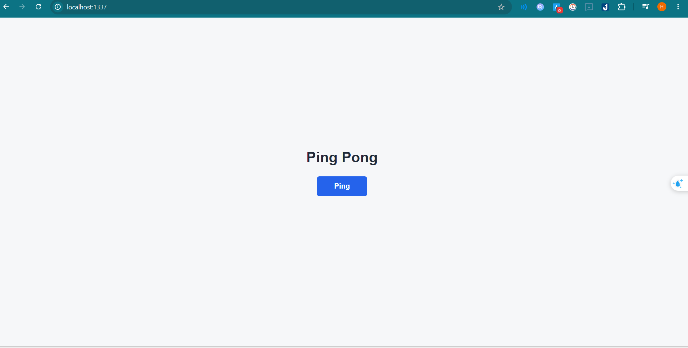
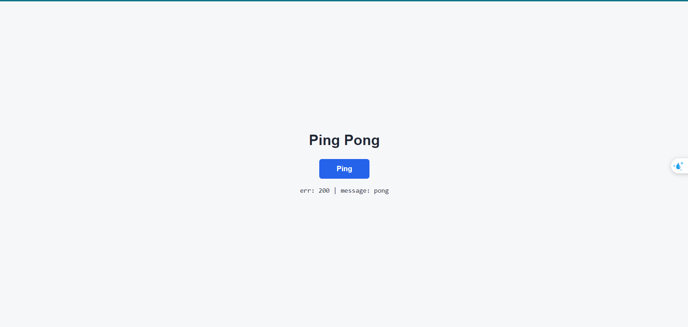

# Bao cao thuc tap ngay 1 - Sails Ping Pong

## 1. Muc tieu

Xay dung moi truong backend bang Sails, ket noi MongoDB local va tao frontend don gian co nut `Ping`.

Khi bam nut `Ping`, frontend goi sang backend bang API tu khai bao trong `config/routes.js`. Backend tra ve `pong` theo dung phong bi response cua du an:

```json
{
  "err": 200,
  "message": "pong",
  "data": {
    "result": "pong"
  }
}
```

## 2. Cong nghe su dung

- Backend: Sails v1.5.18
- Database: MongoDB local
- Frontend: EJS server-side render + HTML/CSS/JavaScript thuan
- HTTP API method: POST

## 3. Cau hinh chinh

### 3.1. Tat blueprint

Du an da tat blueprint trong `config/blueprints.js`:

- `actions: false`
- `rest: false`
- `shortcuts: false`

Vi vay Sails khong tu sinh API. Tat ca endpoint can duoc khai bao thu cong trong `config/routes.js`.

### 3.2. Ket noi MongoDB local

Datastore mac dinh duoc cau hinh trong `config/datastores.js`:

```js
default: {
  adapter: 'sails-mongo',
  url: 'mongodb://localhost:27017/Jits_mini_project'
}
```

### 3.3. Route tu khai bao

File `config/routes.js` khai bao:

```js
'GET /': 'ClicksController.index',
'POST /api/v1/ping': 'PingController.ping',
```

Endpoint API dung `POST`, dung theo quy uoc cua du an.

### 3.4. Controller co dien

Controller ping duoc viet theo kieu co dien trong `api/controllers/PingController.js`:

```js
module.exports = {
  ping: function(req, res) {
    return res.status(200).json({
      err: 200,
      message: 'pong',
      data: {
        result: 'pong'
      }
    });
  }
};
```

HTTP status luon la `200`. Client phan biet thanh cong hay loi bang truong `err`.

## 4. Frontend

Trang frontend nam trong `views/pages/homepage.ejs`.

Trang nay duoc render boi Sails qua:

```js
return res.view('pages/homepage', { layout: false });
```

Su dung `layout: false` de bo navbar, header, footer mac dinh cua scaffold Sails. Trang hien tai chi gom:

- Tieu de `Ping Pong`
- Nut `Ping`
- Vung hien thi ket qua `err` va `message`

Khi bam nut `Ping`, JavaScript tren browser goi:

```js
fetch('/api/v1/ping', {
  method: 'POST',
  headers: {
    'Content-Type': 'application/json'
  },
  body: JSON.stringify({})
});
```

## 5. Luong request trong Sails

Luong request cua chuc nang ping:

1. Browser mo `GET /`.
2. Sails doc route trong `config/routes.js`.
3. Route `GET /` goi `ClicksController.index`.
4. Controller render `views/pages/homepage.ejs` va tra HTML ve browser.
5. Nguoi dung bam nut `Ping`.
6. Browser goi `POST /api/v1/ping`.
7. Sails doc route `POST /api/v1/ping`.
8. Route goi `PingController.ping`.
9. Controller tra JSON theo phong bi `{ err, message, data }`.
10. JavaScript tren frontend cap nhat noi dung ket qua len man hinh.

## 6. Cach Sails load file khi start app

Khi chay `npx sails lift`, Sails se:

1. Doc cac file cau hinh trong thu muc `config/`.
2. Load route trong `config/routes.js`.
3. Load controller trong `api/controllers/`.
4. Load model trong `api/models/`.
5. Khoi tao datastore theo `config/datastores.js`.
6. Lift HTTP server o `http://localhost:1337`.

## 7. Cach chay du an

Yeu cau MongoDB local dang chay o port `27017`.

Chay lenh:

```bash
npm install
npx sails lift
```

Mo trinh duyet:

```text
http://localhost:1337
```

## 8. Minh chung ket qua

### 8.1. Trang frontend truoc khi bam Ping



### 8.2. Trang frontend sau khi bam Ping

Sau khi bam nut `Ping`, frontend nhan response tu backend va hien thi:

```text
err: 200 | message: pong
```



## 9. Ket luan

Chuc nang ngay 1 da hoan thanh:

- Backend Sails chay duoc.
- Backend ket noi MongoDB local.
- Blueprint da tat, endpoint duoc khai bao thu cong.
- API su dung method `POST`.
- Controller dung kieu co dien `(req, res)`.
- Response dung phong bi `{ err, message, data }`.
- Frontend co nut `Ping`.
- Bam nut `Ping` goi backend va hien thi duoc `err`, `message`.
